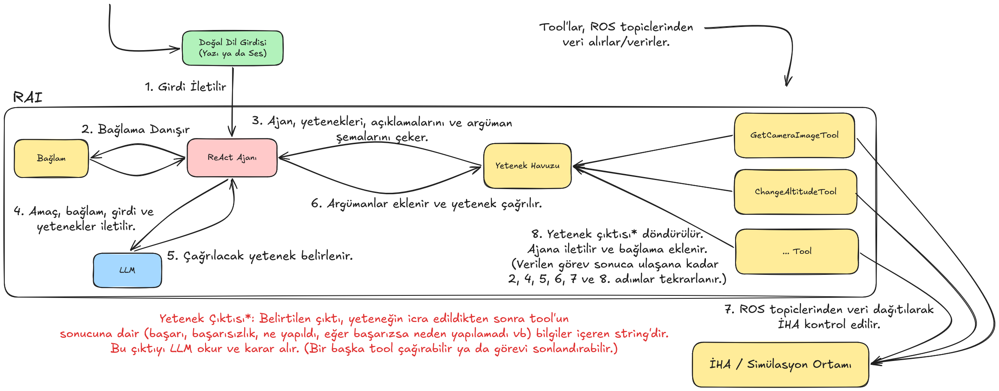

# STM - Agentic LLM ile İHA Kontrolü Projesi

Bu proje, agentic LLM kullanılarak İHA'yı otonom kontrol etmek için yetenek kazandırmayı amaçlar. Yapılan tüm çalışma simülasyon ortamında test edilir.

## Temel Bileşenler ve Akış
Kullanılan bileşenler ve ilgili dokümantasyonlar:


1. Webots, Simülasyon Ortamı. [Website](https://cyberbotics.com/#cyberbotics) |  [Drone Modeli](https://www.cyberbotics.com/doc/guide/mavic-2-pro?version=R2021a) | [Simülasyon Dünyası](https://github.com/omichel/webots/tree/master/projects/robots/dji/mavic/worlds)
2. RAI, Robotics için Agentic LLM framework'ü. [Repository](https://github.com/RobotecAI/rai) | [Repository Dokümantasyonu](https://robotecai.github.io/rai/)
3. ROS2 Humble, Robotik işlemler için mesaj broker'ı. [Dokümantasyon](https://docs.ros.org/en/humble/index.html)

## Akış: 



Yukarıdaki şemada "Bağlam" olarak gösterilen bileşen, RAI içerisinde LangChain ve LangGraph işlemleri ile gerçekleştirilir.

"Yetenek" olarak bahsedilen bileşenler RAI içerisinde 'tool' olarak bahsedilmiştir.


## Projeyi Çalıştırma

Projeyi uygun şekilde çalıştırmak için **NVIDIA ekran kartına sahip** Docker kurulu bir Ubuntu dağıtımı üzerinden:

1. Projeyi clone edin.
2. Proje dizinine konumlanın.
3. **build.linux.sh** scriptini çalıştırın. (İnternet hızına bağlı olarak 30 dk kadar sürebilir.)

**run.linux.sh** ile container'i oluşturun. Container çalıştıktan sonra bir süre bekleyin ve **Enter**'a basın. Artık komut yazabilirsiniz.

Container'ın NVIDIA ekran kartınıza bağlandığını test etmek için `nvidia-smi` komutunu kontrol edin ve `glxinfo | grep OpenGL` komutu ile ekran kartınızın tanındığını doğrulayın. Aksi takdirde simülasyonda takılmalar olabilir. Projeyi çalıştırdığınız her farklı bilgisayar için bir defa kontrol etmeniz yeterlidir. Ekran kartının tanınması ile ilgili resmi dokümantasyon: [https://cyberbotics.com/doc/guide/verifying-your-graphics-driver-installation](https://cyberbotics.com/doc/guide/verifying-your-graphics-driver-installation)

Kullanılacak LLM'in bilgilerini sisteme girmek için:

```bash
cd /rai/rai_workspace/agents
cp .env.example .env

# .env dosyasına gerekli bilgileri girin.
vim .env
```


Container'ın masaüstüne [http://localhost:6080](http://localhost:6080) adresi üzerinden ulaşabilirsiniz.
Bu adresten masaüstüne erişim sağlayın ve **iki tane** terminal açın. 

İlk terminalde:
```bash
cd /rai/rai_workspace/simulation
./run_simulation.sh
```

Simülasyon tamamen çalışana ve drone havalanana kadar bekleyin. Eğer simülasyon açılır fakat drone havalanmazsa **terminal üzerinden** process'i **terminate (CTRL + C)** edin. Ardından tekrar `./run_simulation.sh` scriptini çalıştırın. 

İkinci terminalde:

```bash
cd /rai/rai_workspace/frontend
./run_frontend.sh
```

İHA'ya komut verebilirsiniz.

## Projeyi Dosya Yapısı ve Dosyaların İçeriği

**Önemli!!!:** Projeye eklediğiniz dosyaların kalıcı olması için **container dışında** `volume_data/rai_workspace` klasörünün altında, **container içinde** `/rai/rai_workspace` klasörünün altında olmalıdır. Volume tanımı için [run scriptini](./run.linux.sh) inceleyebilirsiniz.

1. [rai_workspace/agent](./volume_data/rai_workspace/agent/):

   1.1. [.env.example](./volume_data/rai_workspace/agent/.env.example): LLM erişim bilgileri ve diğer gizli çevre değişkenlerini tanımladığınız dosya. Programı çalıştırmak için bu dosyayı **.env** adıyla **aynı dizine** kopyalayın ve buraya gerekli bilgileri girin. \
   1.2. [function_def_get_llm_model.py](./volume_data/rai_workspace/agent/function_def_get_llm_model.py): Kullanılacak LLM objesinin oluşturulduğu dosya. \
   1.3. [function_def_initialize_agent.py](./volume_data/rai_workspace/agent/function_def_initialize_agent.py): ReAct agent'inin, kullanılacak tool'ların, embodiment'ın tanımlandığı dosya.
2. [rai_workspace/embodiments](./volume_data/rai_workspace/embodiments/):

    2.1. [main.json](./volume_data/rai_workspace/embodiments/main.json): Embodiment içeriği.
3. [rai_workspace/frontend](./volume_data/rai_workspace/frontend/):

    3.1. [function_def_run_streamlit_app.py](./volume_data/rai_workspace/frontend/function_def_run_streamlit_app.py): Kullanıcı girdisinin alındığı frontend uygulamayı içeren dosya. **Bu dosyayı salt çalıştırmayın.** \
    3.2. [app.py](./volume_data/rai_workspace/frontend/app.py): Frontend uygulamasını çalıştıran dosya. **Bu dosyayı salt çalıştırmayın.** Uygulamayı çalıştırmak için -> `./run_frontend.sh` \
    3.3. [run_frontend.sh](./volume_data/rai_workspace/frontend/run_frontend.sh): Frontend uygulamasını çalıştıran script.
4. [rai_workspace/tools](./volume_data/rai_workspace/tools/): Tool'ın (yeteneklerin) tanımları. **Not:** Yeni bir tool eklemek istediğinizde BaseTool sınıfından inherit edin/türetin.
5. [rai_workspace/models](./volume_data/rai_workspace/models/): Yapay zeka modellerinin (YOLO, Llama) ağırlık dosyaları. 
6. [rai_workspace/simulation](./volume_data/rai_workspace/simulation/): Simülasyon dünyasının dosyalarını ve konfigürasyonlarını içerir.

    6.1. [run_simulation.sh](./volume_data/rai_workspace/simulation/run_simulation.sh): Simülasyon dünyasını başlatan script. \
    6.2. [run_teleop.sh](./volume_data/rai_workspace/simulation/run_teleop.sh) Manuel drone kontrolcüsünü başlatan dosya. (Bu scripti çalıştırmadan önce simülasyonu çalıştırın.) Ardından belirtilen tuşlar ile drone'u kontrol edebilirsiniz. İngilizce klavye kullandığınızdan emin olun.
    


